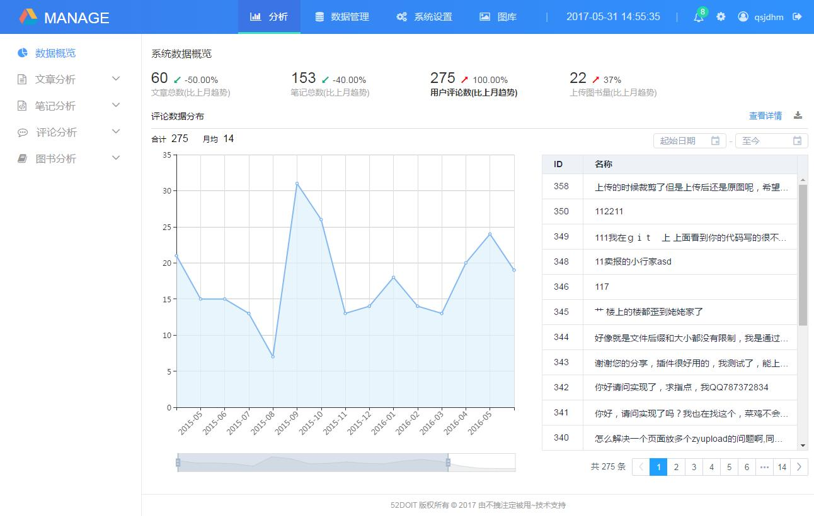
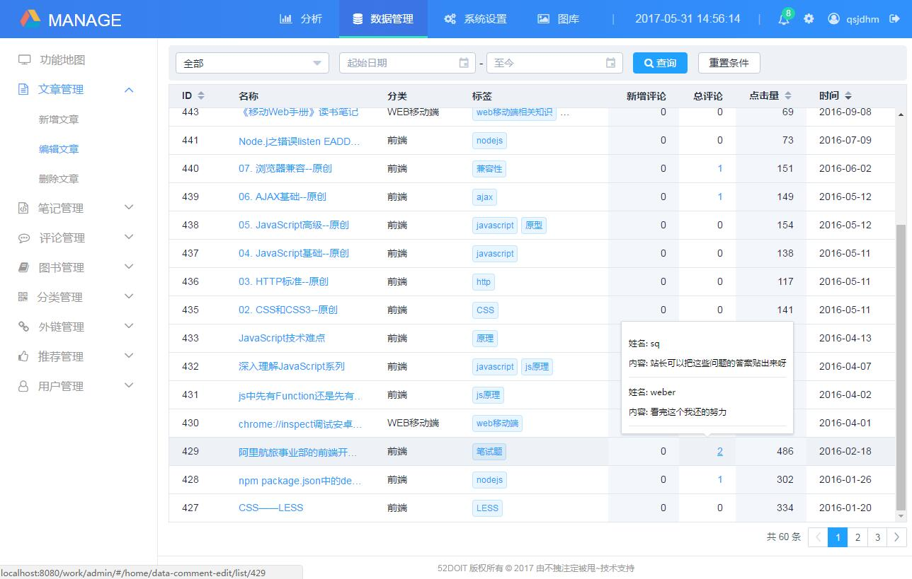
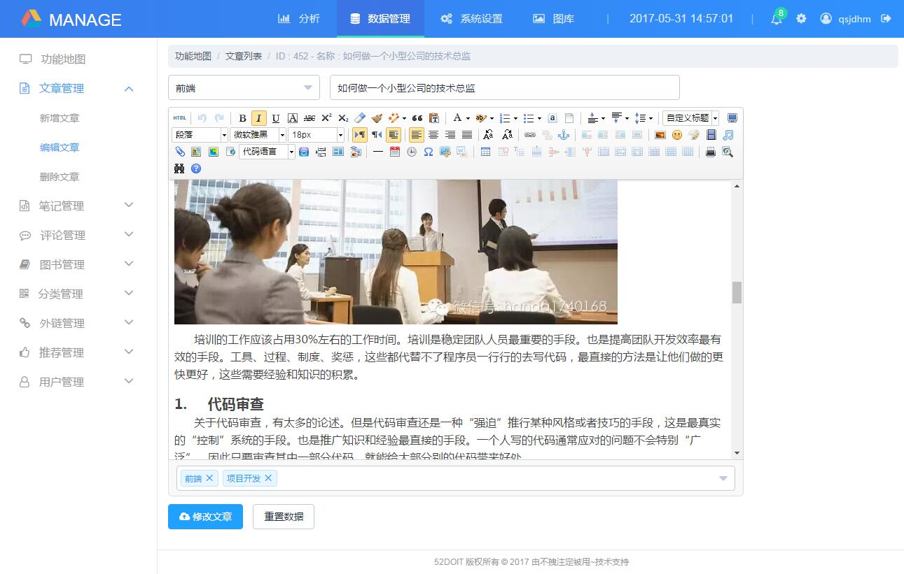
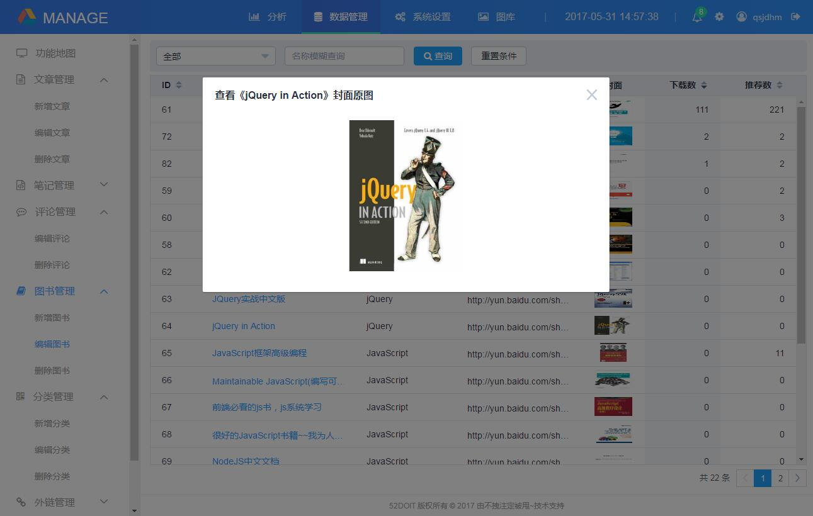
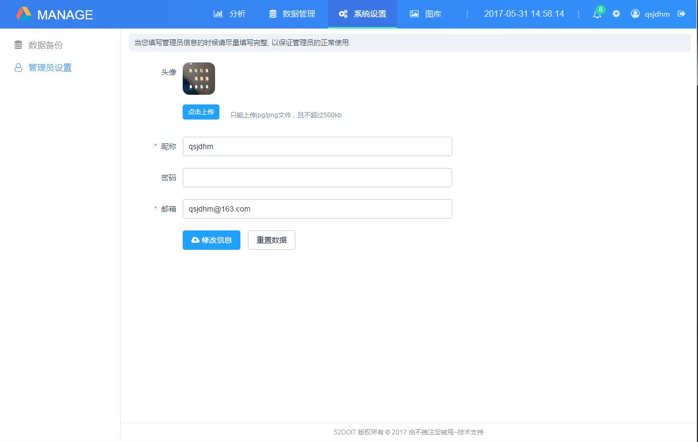
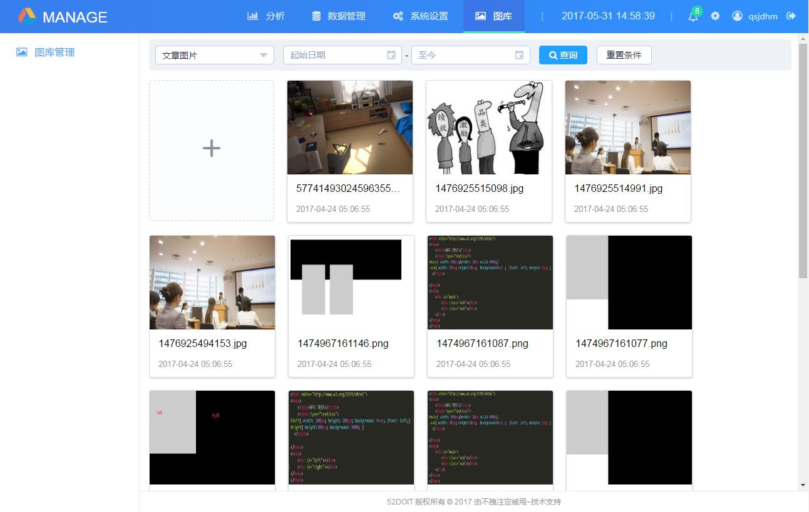

# work -- vue+vuex版后台管理系统（分析、数据管理、系统设置、图库）
各种截图（截图内容很多，请耐心等待）

* by zhangyan 2017-04-22            email : qsjdhm@163.com

# 目录介绍
* src文件夹下面是java代码、WebContent/WEB-INF下是后台配置文件
* WebContent文件夹下面是前端代码
* - admin      后台管理系统代码
* --   build    webpack配置文件
* --   config   后台管理系统配置文件
* --   dist     npm run pro编译后的文件（用于系统发布）
* --   src      功能源码
* --   uploads  上传的图片
* - backupFile 数据库备份文件
* - column     前台页面频道代码
* - common     项目前端一些通用文件
* - staticFile 静态化生成的前台页面

#后端使用技术
* 数据库采用mysql5
* 后台路由采用spring mvc
* 静态化采用freemarker + java流生成文件
* 后台服务采用spring + hibernate来实现快速的搭建整个MVC中的M模块

#后台管理系统页面使用技术
* vue基础框架
* vuex数据状态树管理
* vue-resource请求后台数据
* vue-router路由按需加载
* element-ui作为ui框架
* echarts负责图表分析展示
* webpack-dev-server

#前台页面使用技术
* jquery + bootstrap
* ueditor

#如果对你有所帮助，欢迎点赞

